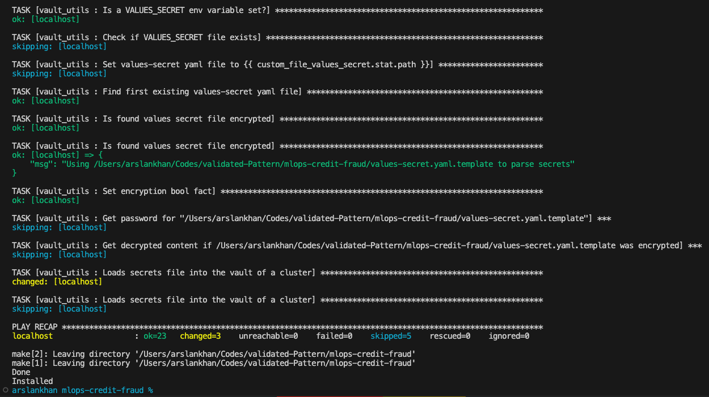
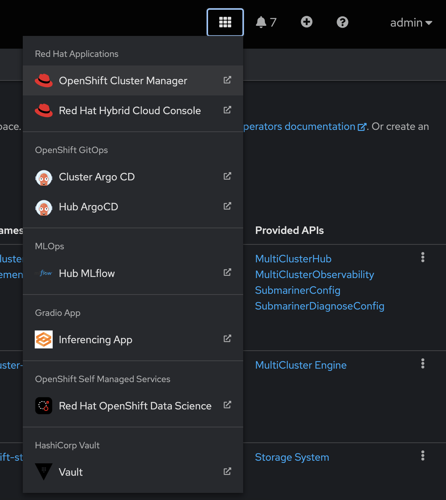
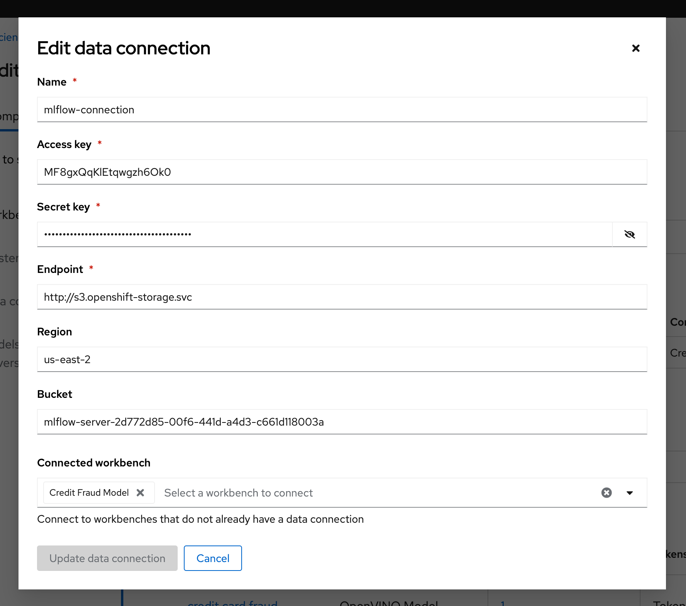
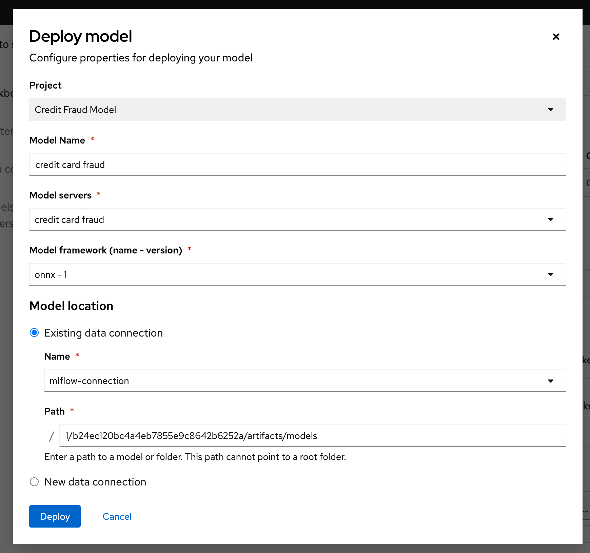
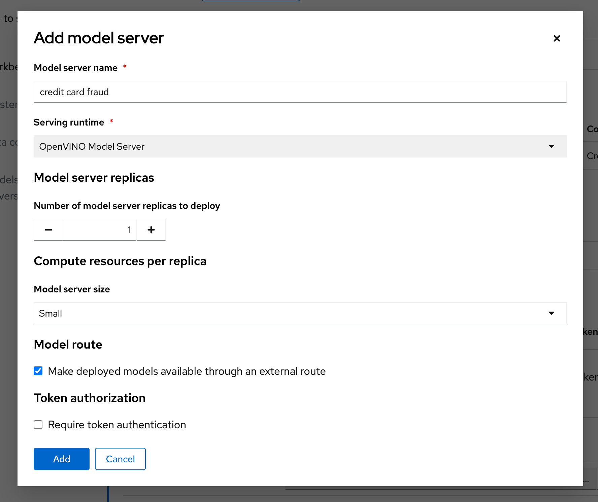
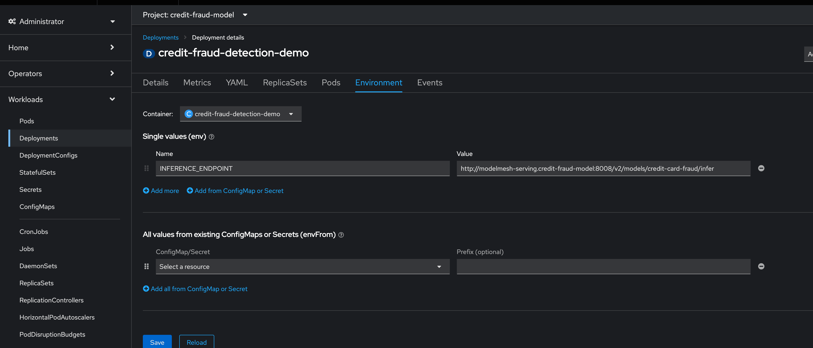
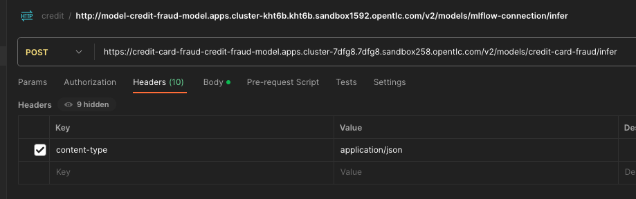

# Credit Card Fraud Detection Demo using MLFlow and Red Hat OpenShift Data Science

[GitHub Source](https://github.com/red-hat-data-services/credit-fraud-detection-demo)

# Introduction
>**This deployment is based on validated pattern framework that uses GitOps to easily provision all operators and apps.** 
>**This greatly reduces the time to provision everything manually.** 
## Pre-requisites

- Podman 
- Cloned https://github.com/arslankhanali/mlops-credit-fraud locally
- Openshift cluster cli login

## Demo Description & Architecture

The goal of this demo is to demonstrate how RHODS and MLFlow can be used together to build an end-to-end MLOps platform where we can:

- Build and train models in RHODS
- Track and store those models with MLFlow
- Serve a model stored in MLFlow using RHODS Model Serving (or MLFlow serving)
- Deploy a model application in OpenShift that runs sends data to the served model and displays the prediction

The architecture looks like this:


Description of each component:

- **Data Set:** The data set contains the data used for training and evaluating the model we will build in this demo.
- **RHODS Notebook:** We will build and train the model using a Jupyter Notebook running in RHODS.
- **MLFlow Experiment tracking:** We use MLFlow to track the parameters and metrics (such as accuracy, loss, etc) of a model training run. These runs can be grouped under different "experiments", making it easy to keep track of the runs.
- **MLFlow Model registry:** As we track the experiment we also store the trained model through MLFlow so we can easily version it and assign a stage to it (for example Staging, Production, Archive).
- **S3 (ODF):** This is where the models are stored and what the MLFlow model registry interfaces with. We use ODF (OpenShift Data Foundation) according to the [MLFlow guide](/tools-and-applications/mlflow/mlflow/), but it can be replaced with another solution.  
- **RHODS Model Serving:** We recommend using RHODS Model Serving for serving the model. It's based on ModelMesh and allows us to easily send requests to an endpoint for getting predictions.
- **Application interface:** This is the interface used to run predictions with the model. In our case, we will build a visual interface (interactive app) using Gradio and let it load the model from the MLFlow model registry.

The model we will build is a Credit Card Fraud Detection model, which predicts if a credit card usage is fraudulent or not depending on a few parameters such as: distance from home and last transaction, purchase price compared to median, if it's from a retailer that already has been purchased from before, if the PIN number is used and if it's an online order or not.

## Deploying the demo
Following commands will take about 15-20 minutes
>**Validated pattern will be deployed** 
```sh
git clone https://github.com/arslankhanali/mlops-credit-fraud
cd mlops-credit-fraud
oc login --token=<> --server=<> # login to Openshift cluster
podman machine start
./pattern.sh make install
```
Finished Installation will look like:

>**TA DA!!! Everything you need is already deplyed** 
Access installed components from UI:  


### 1: Get the MLFlow Route using command-line
You can use the OC command to get the hostname through:  
`oc get svc mlflow-server -n mlops -o go-template --template='{{.metadata.name}}.{{.metadata.namespace}}.svc.cluster.local{{println}}'`  

The port you will find with: `oc get svc mlflow-server -n mlops -o yaml` 


In my case it was: `mlflow-server.mlops.svc.cluster.local:8080`  
We will use this value when creating the work bench   
`MLFLOW_ROUTE`=`http://mlflow-server.mlops.svc.cluster.local:8080`  
### 2: Create a RHODS workbench

Start by opening up RHODS by clicking on the 9 square symbol in the top menu and choosing "Red Hat OpenShift Data Science".


Then create a new Data Science project (see image), this is where we will build and train our model. This will also create a namespace in OpenShift which is where we will be running our application after the model is done.
I'm calling my project 'Credit Card Fraud', feel free to call yours something different but be aware that some things further down in the demo may change.


After the project has been created, create a workbench where we can run Jupyter.
There are a few important settings here that we need to set:

- **Name:** Credit Fraud Model
- **Notebook Image:** Standard Data Science
- **Deployment Size:** Small
- **Environment Variable:** Add a new one that's a **Config Map -> Key/value** and enter 
    - Get value by running: `oc get service mlflow-server -n mlops -o go-template --template='http://{{.metadata.name}}.{{.metadata.namespace}}.svc.cluster.local:8080{{println}}' `
    - **Key:** `MLFLOW_ROUTE` 
    - **Value:** `http://<route-to-mlflow>:<port>`, replacing `<route-to-mlflow>` and `<port>` with the route and port that we found in [step one](#11-mlflow-route-through-the-visual-interface).  In my case it is `http://mlflow-server.mlflow.svc.cluster.local:8080`.
- **Cluster Storage:** Create new persistent storage - I call it "Credit Fraud Storage" and set the size to 20GB.


Press Create Workbench and wait for it to start - status should say "Running" and you should be able to press the Open link.


Open the workbench and login if needed.

### 3: Train the model
When inside the workbench (Jupyter), we are going to clone a GitHub repository which contains everything we need to train (and run) our model.  
You can clone the GitHub repository by pressing the GitHub button in the left side menu (see image), then select "Clone a Repository" and enter this GitHub URL: [https://github.com/red-hat-data-services/credit-fraud-detection-demo](https://github.com/red-hat-data-services/credit-fraud-detection-demo) 


Open up the folder that was added (credit-fraud-detection-demo).
It contains:

- Data for training and evaluating the model.
- A notebook (model.ipynb) inside the `model` folder with a Deep Neural Network model we will train.
- An application (model_application.py) inside the `application` folder that will fetch the trained model from MLFlow and run a prediction on it whenever it gets any user input.

The `model.ipynb` is what we are going to use for building and training the model, so open that up and take a look inside, there is documentation outlining what each cell does. What is particularly interesting for this demo are the last two cells.

The second to last cell contains the code for setting up MLFlow tracking:

```python
mlflow.set_tracking_uri(MLFLOW_ROUTE)
mlflow.set_experiment("DNN-credit-card-fraud")
mlflow.tensorflow.autolog(registered_model_name="DNN-credit-card-fraud")
```

`mlflow.set_tracking_uri(MLFLOW_ROUTE)` just points to where we should send our MLFlow data.
`mlflow.set_experiment("DNN-credit-card-fraud")` tells MLFlow that we want to create an experiment, and what we are going to call it. In this case I call it "DNN-credit-card-fraud" as we are building a Deep Neural Network.
`mlflow.tensorflow.autolog(registered_model_name="DNN-credit-card-fraud")` enables autologging of a bunch of variables (such as accuracy, loss, etc) so we don't manually have to track them. It also automatically uploads the model to MLFlow after the training completes. Here we name the model the same as the experiment.

Then in the last cell we have our training code:

```python
with mlflow.start_run():
    epochs = 2
    history = model.fit(X_train, y_train, epochs=epochs, \
                        validation_data=(scaler.transform(X_val),y_val), \
                        verbose = True, class_weight = class_weights)

    y_pred_temp = model.predict(scaler.transform(X_test))

    threshold = 0.995

    y_pred = np.where(y_pred_temp > threshold, 1,0)
    c_matrix = confusion_matrix(y_test,y_pred)
    ax = sns.heatmap(c_matrix, annot=True, cbar=False, cmap='Blues')
    ax.set_xlabel("Prediction")
    ax.set_ylabel("Actual")
    ax.set_title('Confusion Matrix')
    plt.show()

    t_n, f_p, f_n, t_p = c_matrix.ravel()
    mlflow.log_metric("tn", t_n)
    mlflow.log_metric("fp", f_p)
    mlflow.log_metric("fn", f_n)
    mlflow.log_metric("tp", t_p)

    model_proto,_ = tf2onnx.convert.from_keras(model)
    mlflow.onnx.log_model(model_proto, "models")
```
`with mlflow.start_run():` is used to tell MLFlow that we are starting a run, and we wrap our training code with it to define exactly what code belongs to the "run".  
Most of the rest of the code in this cell is normal model training and evaluation code, but at the bottom we can see how we send some custom metrics to MLFlow through `mlflow.log_metric` and then convert the model to ONNX. This is because ONNX is one of the standard formats for RHODS Model Serving which we will use later.


Now run all the cells in the notebook from top to bottom, either by clicking Shift-Enter on every cell, or by going to Run->Run All Cells in the very top menu.  
If everything is set up correctly it will train the model and push both the run and the model to MLFlow.  
The run is a record with metrics of how the run went, while the model is the actual tensorflow and ONNX model which we later will use for inference.  
You may see some warnings in the last cell related to MLFlow, as long as you see a final progressbar for the model being pushed to MLFlow you are fine:


### 4: View the model in MLFlow
Let's take a look at how it looks inside MLFlow now that we have trained the model.  
Open the MLFlow UI from the shortcut.  


We will need the Full Path of the model in the next section when we are going to serve it, so keep this open. 


### 5: Serve the model
> **NOTE:** You can either serve the model using RHODS Model Serving or use the model straight from MLFlow.  
> We will here show how you serve it with RHODS Model Serving as that scales better for large applications and load.  
> At the bottom of this section we'll go through how it would look like to use MLFlow instead.

To start, go to your RHODS Project and click "Add data connection".
This data connection connects us to a storage we can load our models from.


Here we need to fill out a few details. These are all assuming that you set up MLFlow according to this [guide](/tools-and-applications/mlflow/mlflow/) and have it connected to ODF. If that's not the case then enter the relevant details for your usecase.
Copy the code section below and run it all to find your values.  
```sh
# DATA CONNECTIONS values
echo ==========mlflow-connection===========
echo "Name \nmlflow-connection"
echo AWS_ACCESS_KEY_ID
oc get secrets mlflow-server -n mlops -o json | jq -r '.data.AWS_ACCESS_KEY_ID|@base64d'
echo AWS_SECRET_ACCESS_KEY
oc get secrets mlflow-server -n mlops -o json | jq -r '.data.AWS_SECRET_ACCESS_KEY|@base64d'
echo "AWS_DEFAULT_REGION \nus-east-2" # in my case
echo AWS_S3_ENDPOINT
oc get configmap mlflow-server -n mlops -o go-template --template='http://{{.data.BUCKET_HOST}}{{println}}' 
echo AWS_S3_BUCKET
oc get configmap mlflow-server -n mlops -o go-template --template='{{.data.BUCKET_NAME}}{{println}}' 
echo ==========mlflow-connection===========
#
```

Then press "Add data connection".  
Here's an example of how it can look like:  


Then we will configure a model server, which will serve our models.


Just check the 'Make deployed available via an external route' checkbox and then press "Configure" at the bottom.

Finally, we will deply the model, to do that, press the "Deploy model" button which is in the same place that "Configure Model" was before.  
We need to fill out a few settings here:

- **Name**: credit card fraud
- **Model framework**: onnx-1 - Since we saved the model as ONNX in the [model training section](#3-train-the-model)
- **Model location**:
    - **Name**: `mlflow-connection`
    - **Folder path**: This is the full path we can see in the MLFlow interface from the end of the [previous section](#4-view-the-model-in-mlflow). In my case it's `1/b86481027f9b4b568c9efa3adc01929f/artifacts/models/`.  
    Beware that we only need the last part, which looks something like: `1/..../artifacts/models/`
    


Press Deploy and wait for it to complete. It will show a green checkmark when done.  
You can see the status here:


Click on "Internal Service" in the same row to see the endpoints, we will need those when we deploy the model application.


### 6: Access the model application
The model application is a visual interface for interacting with the model. You can use it to send data to the model and get a prediction of whether a transaction is fraudulent or not.   
It is deployed in `credit-fraud-model` project.  
You can access the model application from the 9box short-cut on top right in openshift console .  `Inferencing App`

#### Check the `INFERENCE_ENDPOINT` env variable value
Go to https://your-uri/ns/credit-fraud-model/deployments/credit-fraud-detection-demo/environment.  
Make sure correct INFERENCE_ENDPOINT value is set. In my case it is `http://modelmesh-serving.credit-fraud-model:8008/v2/models/credit-card-fraud/infer`

#### You can get this value from
- **Value**: In the RHODS projects interface (from the previous section), copy the "restURL" and add `/v2/models/credit-card-fraud/infer` to the end if it's not already there. For example: `http://modelmesh-serving.credit-card-fraud:8008/v2/models/credit-card-fraud/infer`


Congratulations, you now have an application running your AI model!

Try entering a few values and see if it predicts it as a credit fraud or not. You can select one of the examples at the bottom of the application page.


# RC notes
> You can ignore these
- Rhods source(source: certified-operators) was wrong in hub file. gave errors. Rhods requires `redhat-ods-operator` namespace.
- odf app was added otherwise objectbucketclaim in mlflow app gave error. ODf when deployed correctly should create secret and config map.
- make sure to delete limitrange in credit-card-fraud project after you create the work bench in rhods. otherwise workbench gets stuck in pending state.
- With internal route INFERENCE_ENDPOINT=http://modelmesh-serving.credit-fraud-model:8008/v2/models/credit-card-fraud/infer
- With external route INFERENCE_ENDPOINT=https://credit-card-fraud-credit-fraud-model.apps.cluster-7dfg8.7dfg8.sandbox258.opentlc.com/v2/models/credit-card-fraud/infer
- For buildconfig stuff https://www.tutorialworks.com/openshift-dockerfile/
- created 2 imagestreams. one is base with python, other is resultant IS from BC.
- Should convert app deployment chart to general helm chart

```sh
# Argo password
oc get secret openshift-gitops-cluster -n openshift-gitops -o json | jq -r '.data | with_entries(.value |= @base64d)'
# MLFLOW_ROUTE value
oc get service mlflow-server -n mlops -o go-template --template='http://{{.metadata.name}}.{{.metadata.namespace}}.svc.cluster.local:8080{{println}}' 
# DATA CONNECTIONS values
oc get secrets mlflow-server -n mlops -o json | jq -r '.data.AWS_ACCESS_KEY_ID|@base64d'
oc get secrets mlflow-server -n mlops -o json | jq -r '.data.AWS_SECRET_ACCESS_KEY|@base64d'
echo "Region: us-east-2"
oc get configmap mlflow-server -n mlops -o go-template --template='http://{{.data.BUCKET_HOST}}{{println}}' 
oc get configmap mlflow-server -n mlops -o go-template --template='{{.data.BUCKET_NAME}}{{println}}' 
#
```
- endpoint needs to start with `http://`


- make sure path ends with `models` not `model`





# Multicloud Gitops

[](https://opensource.org/licenses/Apache-2.0)

[Live build status](https://validatedpatterns.io/ci/?pattern=mcgitops)

## Start Here

If you've followed a link to this repository, but are not really sure what it contains
or how to use it, head over to [Multicloud GitOps](http://hybrid-cloud-patterns.io/multicloud-gitops/)
for additional context and installation instructions
